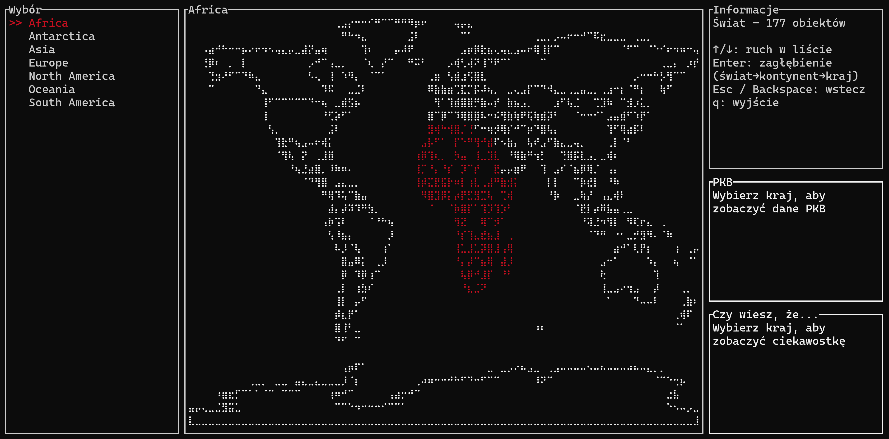
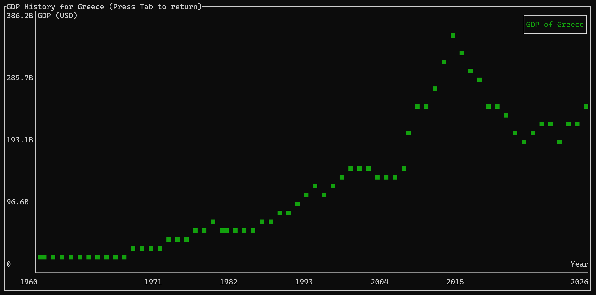

**RustAtlas** 🌍

**RustAtlas** is a terminal-based (TUI) application written in Rust for exploring geographic data directly in your console. Leveraging the power of [`ratatui`](https://github.com/ratatui-org/ratatui) and [`crossterm`](https://crates.io/crates/crossterm), RustAtlas provides an interactive interface to navigate world, continent, and country maps, view detailed information, and seamlessly travel through historical selections.

---

## Screenshots


*Main interface showing country selection and map*


*GDP historical data visualization*

---

## Features

* **Hierarchical Navigation**: Explore data at three levels:

    * **World**: View all continents.
    * **Continent**: Drill down into countries within a selected continent.
    * **Country**: See an individual country boundary and details.

* **Interactive Map Rendering**: Render GeoJSON outlines as vector graphics in the terminal. Automatically filters out minor polygon components to focus on the primary shape.

* **Detailed Country Info**: Display capital, area, population, and currency for each country (loaded from a JSON data source).

* **GDP Data Visualization**: View historical GDP data from World Bank for selected countries, with both summary and detailed chart views.

* **Keyboard Controls**:

    * `↑` / `↓`: Move selection up/down in lists.
    * `Enter`: Dive into the selected geographic level.
    * `Esc` / `Backspace`: Go back to the previous level.
    * `Tab`: Toggle GDP chart display for the selected country.
    * `q`: Quit the application.

* **State Persistence**: Keeps a navigation history to allow seamless backward navigation.

---

## Installation & Setup

1. **Clone the repository**:

   ```bash
   git clone https://github.com/yourusername/RustAtlas.git
   cd RustAtlas
   ```

2. **Prepare data**:

    * Create a `data/` directory at the project root.
    * Place the following files inside `data/`:

        * `world.geojson` and `continent_{name}.geojson` files for drawing.
        * `continent_{name}.json` and `country_{name}.json` lists of names.
        * `country_info.json` containing a map of country keys to metadata.
        * `gdp_data.csv` containing World Bank GDP data (from https://data.worldbank.org/indicator/NY.GDP.MKTP.CD).

3. **Build & Run**:

   ```bash
   cargo run --release -- data
   ```

---

## Data Structure

* **GeoJSON Files**:

    * `continent_world.geojson`: All continents.
    * `country_{continent}.geojson`: Countries for each continent.
    * `country_{country}.geojson`: Detailed geometry for a single country.

* **JSON Lists**:

    * `continent_world.json`: List of continent names.
    * `country_{continent}.json`: List of countries for that continent.

* **Country Info**:

  ```json
  {
    "united_states_of_america": {
      "name": "United States of America",
      "capital": "Washington, D.C.",
      "area": 9833520.0,
      "population": 331002651,
      "currency": "USD"
    },
    // ...
  }
  ```

* **GDP Data**:
  
  The application uses GDP data from the World Bank (https://data.worldbank.org/indicator/NY.GDP.MKTP.CD) in CSV format. The data includes GDP values in current USD for countries across multiple years.

---

## Architecture Overview

* **`main.rs`**: Initializes terminal in raw mode, sets up alternate screen, and drives the main event loop.
* **`data.rs`**: Implements `DataCache` for loading JSON lists, GeoJSON data, and country metadata.
* **`map_draw.rs`**: Converts GeoJSON into `geo` library types, filters polygons, computes bounds, and draws shapes using `ratatui::widgets::canvas::Canvas`.
* **`state.rs`**: Defines `AppState` to track current level, selection, navigation history, loaded map, and UI panels.
* **`ui.rs`**: Composes the terminal layout: left list panel, center map canvas, and right info panel.
* **`gdp_reader.rs`**: Parses and processes GDP data from World Bank CSV format.

---

## Future Improvements

* **Zoom & Pan**: Allow dynamic scaling and movement of map view.
* **Search**: Quick search for countries by name.
* **Styling**: Add colored fills or gradients for different regions.
* **Additional Data**: Integrate ISO codes, time zones, and real-time statistics.


---

*Project developed as part of the "Programming in Rust" course, Computer Science, AGH University of Krakow, 2025.*
